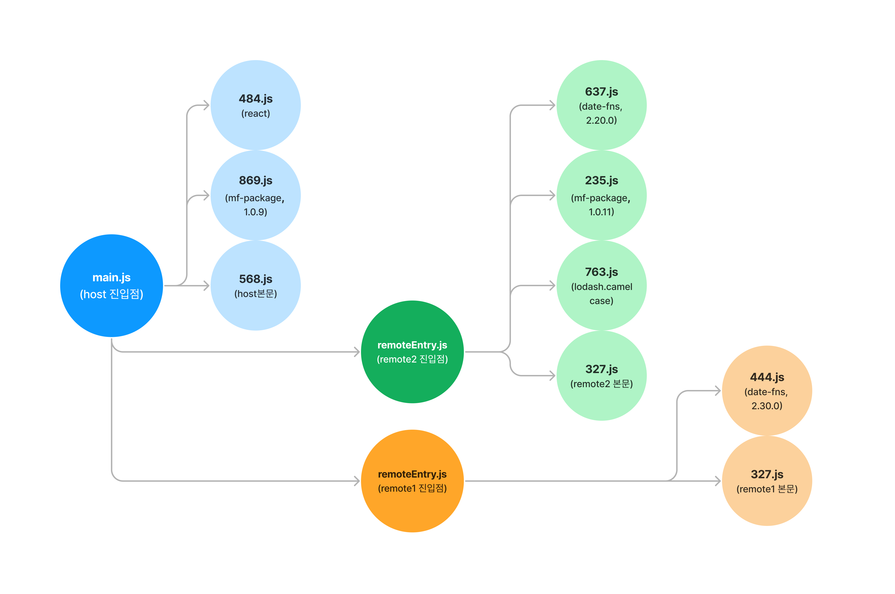

# @module-federation-example-2/root

## App Overview



## Quick Start

```shell
git clone https://github.com/MaxKim-J/module-federation-example-2
cd module-federation-example-2
yarn install
yarn turbo:start

# shared hint 예제
git switch shared-hint-example
```

- `yarn berry(v3.6.0, nodeLinker: node-modules)`와 `yarn workspace`를 사용하고 있습니다.
- 루트 디렉토리에서 `yarn turbo:start`를 실행시키시면, 포트 3개(3000, 3001, 3002)에 3개의 마이크로 앱 서빙이 시작됩니다.
- 브라우저에서는 `localhost:3000`으로 접속하시면 웹앱을 확인할 수 있습니다.
- `shared-hint-example` 브랜치로 체크아웃 하시면 [블로그 글 본문에 언급한](https://maxkim-j.github.io/posts/module-federation-shared#3-shared-hint) shared hint 설정 예제를 보실 수 있어요.
